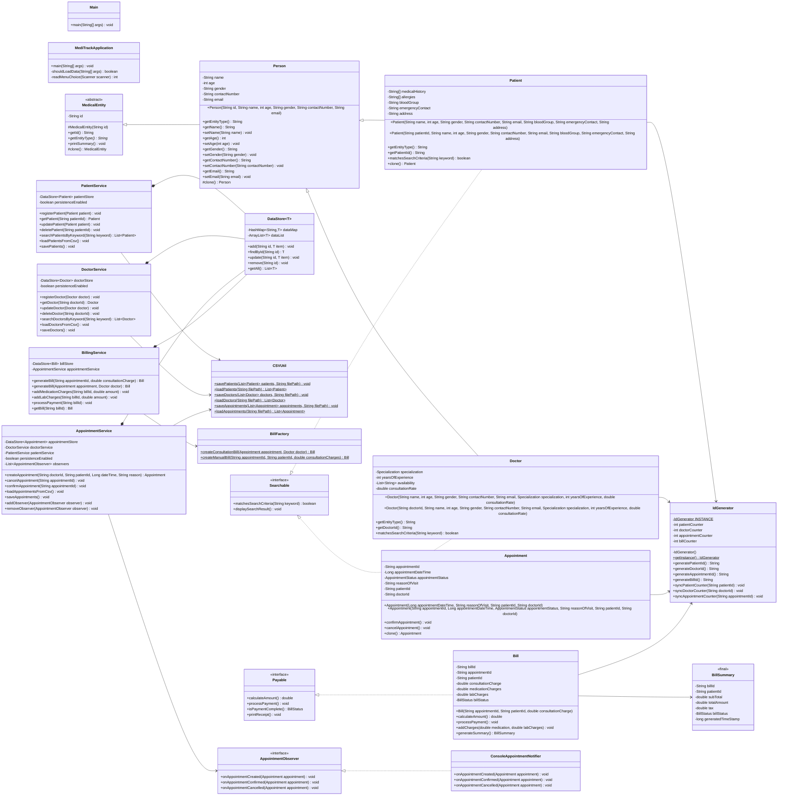
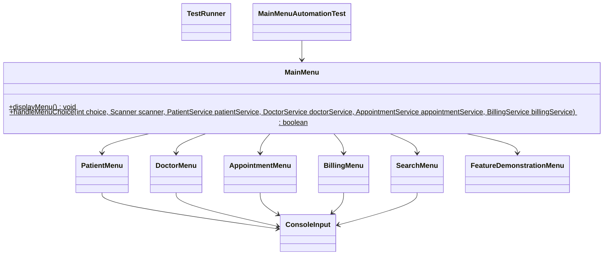

# MediTrack Class UML Diagram

This diagram reflects the current implementation, not the original assignment wish list.

## Domain, Service, Utility, And Pattern UML

## Menu And Test Layer UML

## Notes

- `Person` is concrete but inherits shared identity behavior from abstract `MedicalEntity`.
- `Patient` deep-copies mutable arrays in `clone()`.
- `Appointment` uses `super.clone()` because its fields are IDs, immutable values, or enums.
- `Searchable` is implemented by `Patient` and `Doctor`.
- CSV persistence covers patients, doctors, and appointments. Bills remain in memory only.
- `AppointmentService` owns observer notification because appointment lifecycle changes happen in the service layer.
