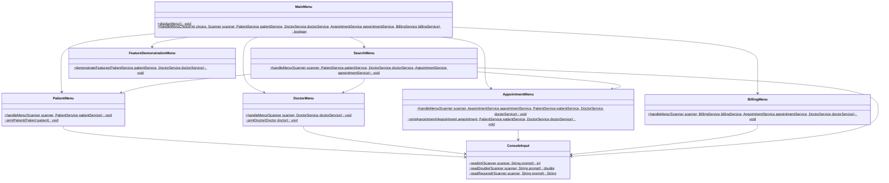

# MediTrack Class UML Diagram

## Domain And Service UML

```mermaid
classDiagram
    direction LR

    class Main {
        +main(String[] args) void
    }

    class MediTrackApplication {
        +main(String[] args) void
        -readMenuChoice(Scanner scanner) int
    }

    class Person {
        -String name
        -int age
        -String gender
        -String contactNumber
        -String email
        +Person(String name, int age, String gender, String contactNumber, String email)
        +getName() String
        +setName(String name) void
        +getAge() int
        +setAge(int age) void
        +getGender() String
        +setGender(String gender) void
        +getContactNumber() String
        +setContactNumber(String contactNumber) void
        +getEmail() String
        +setEmail(String email) void
    }

    class Patient {
        -String patientId
        -String[] medicalHistory
        -String[] allergies
        -String bloodGroup
        -String emergencyContact
        -String address
        +Patient(String name, int age, String gender, String contactNumber, String email, String bloodGroup, String emergencyContact, String address)
        +getPatientId() String
        +getMedicalHistory() String[]
        +setMedicalHistory(String condition) void
        +getAllergies() String[]
        +setAllergies(String[] allergies) void
        +getBloodGroup() String
        +setBloodGroup(String bloodGroup) void
        +getEmergencyContact() String
        +setEmergencyContact(String emergencyContact) void
        +getAddress() String
        +setAddress(String address) void
        +toString() String
    }

    class Doctor {
        -String doctorId
        -Specialization specialization
        -int yearsOfExperience
        -List~String~ availability
        -double consultationRate
        +Doctor(String name, int age, String gender, String contactNumber, String email, Specialization specialization, int yearsOfExperience, double consultationRate)
        +getDoctorId() String
        +getSpecialization() Specialization
        +setSpecialization(Specialization specialization) void
        +getYearsOfExperience() int
        +setYearsOfExperience(int yearsOfExperience) void
        +getAvailability() List~String~
        +setAvailability(List~String~ availability) void
        +getConsultationRate() double
        +setConsultationRate(double consultationRate) void
        +toString() String
    }

    class Appointment {
        -String appointmentId
        -Long appointmentDateTime
        -AppointmentStatus appointmentStatus
        -String reasonOfVisit
        -String patientId
        -String doctorId
        +Appointment(Long appointmentDateTime, String reasonOfVisit, String patientId, String doctorId)
        +confirmAppointment() void
        +cancelAppointment() void
        +getAppointmentId() String
        +getAppointmentDateTime() Long
        +setAppointmentDateTime(Long appointmentDateTime) void
        +getAppointmentStatus() AppointmentStatus
        +setAppointmentStatus(AppointmentStatus appointmentStatus) void
        +getReasonOfVisit() String
        +setReasonOfVisit(String reasonOfVisit) void
        +getPatientId() String
        +getDoctorId() String
        +toString() String
    }

    class Bill {
        -String billId
        -String appointmentId
        -String patientId
        -double consultationCharge
        -double medicationCharges
        -double labCharges
        -double subTotal
        -double tax
        -double totalAmount
        -BillStatus billStatus
        +Bill(String appointmentId, String patientId, double consultationCharge)
        -calculateTotal() void
        +calculateAmount() double
        +processPayment() void
        +isPaymentComplete() BillStatus
        +addCharges(double medication, double labCharges) void
        +addCharges(double medication) void
        +generateSummary() BillSummary
        +getBillId() String
        +getAppointmentId() String
        +getPatient() String
        +getConsultationCharge() double
        +getMedicationCharges() double
        +getLabCharges() double
        +getSubTotal() double
        +getTax() double
        +getTotalAmount() double
        +getBillStatus() BillStatus
    }

    class BillSummary {
        <<final>>
        -String billId
        -String patientId
        -double subTotal
        -double totalAmount
        -double tax
        -BillStatus billStatus
        -long generatedTimeStamp
        +BillSummary(String billId, String patientId, double subTotal, double totalAmount, double tax, BillStatus billStatus)
        +getBillId() String
        +getPatientId() String
        +getSubTotal() double
        +getTotalAmount() double
        +getTax() double
        +getBillStatus() BillStatus
        +getGeneratedTimeStamp() long
        +toString() String
    }

    class PatientService {
        -DataStore~Patient~ patientStore
        +registerPatient(Patient patient) void
        +getPatient(String patientId) Patient
        +updatePatient(Patient patient) void
        +deletePatient(String patientId) void
        +getAllPatient() List~Patient~
        +getAllPatients() List~Patient~
        +searchPatient(String patientId) Patient
        +searchPatient(int age) List~Patient~
        +searchPatient(String name, boolean exactMatch) List~Patient~
    }

    class DoctorService {
        -DataStore~Doctor~ doctorStore
        +registerDoctor(Doctor doctor) void
        +getDoctor(String doctorId) Doctor
        +updateDoctor(Doctor doctor) void
        +deleteDoctor(String doctorId) void
        +getAllDoctors() List~Doctor~
        +searchDoctor(String doctorId) Doctor
        +searchDoctor(int experience) List~Doctor~
        +searchDoctor(Specialization specialization) List~Doctor~
        +searchDoctor(String name, boolean exactMatch) List~Doctor~
    }

    class AppointmentService {
        -DataStore~Appointment~ appointmentStore
        -DoctorService doctorService
        -PatientService patientService
        +AppointmentService(PatientService patientService, DoctorService doctorService)
        +createAppointment(String doctorId, String patientId, Long dateTime, String reason) Appointment
        +bookAppointment(String patientId, String doctorId, Long dateTime, String reason) Appointment
        +getAppointment(String appointmentId) Appointment
        +cancelAppointment(String appointmentId) void
        +confirmAppointment(String appointmentId) void
        +getPatientAppointment(String patientId) List~Appointment~
        +getPatientAppointments(String patientId) List~Appointment~
    }

    class BillingService {
        -DataStore~Bill~ billStore
        -AppointmentService appointmentService
        +BillingService(AppointmentService appointmentService)
        +generateBill(String appointmentId, double consultationCharge) Bill
        +generateBill(Appointment appointment, Doctor doctor) Bill
        +addMedicationCharges(String billId, double amount) void
        +addLabCharges(String billId, double amount) void
        +processPayment(String billId) void
        +getBill(String billId) Bill
    }

    class DataStore~T~ {
        -HashMap~String,T~ dataMap
        -ArrayList~T~ dataList
        +add(String id, T item) void
        +findById(String id) T
        +update(String id, T item) void
        +remove(String id) void
        +getAll() List~T~
        +size() int
        +contains(String id) boolean
    }

    class Validator {
        +isValidAge(int age) boolean
        +isValidEmail(String email) boolean
        +isValidContactNumber(String phone) boolean
        +isValidFee(double fee) boolean
        +validPatient(Patient patient) void
        +validDoctor(Doctor doctor) void
    }

    class IdGenerator {
        -int patientCounter$
        -int doctorCounter$
        -int appointmentCounter$
        -int billCounter$
        +generatePatientId() String$
        +generateDoctorId() String$
        +generateAppointmentId() String$
        +generateBillId() String$
    }

    class DateUtil {
        -SimpleDateFormat dateFormat$
        +formatDateTime(long timestamp) String$
        +parseDateTime(String dateTimeStr) long$
        +isFutureDate(long timestamp) boolean$
    }

    class Payable {
        <<interface>>
        +calculateAmount() double
        +processPayment() void
        +isPaymentComplete() BillStatus
        +printReceipt() void
    }

    class Searchable {
        <<interface>>
        +matchesSearchCriteria(String keyword) boolean
        +displaySearchResult() void
    }

    class Specialization {
        <<enumeration>>
        CARDIOLOGY
        DERMATOLOGY
        NEUROLOGY
        PEDIATRICS
        ORTHOPEDICS
        GENERAL_MEDICINE
    }

    class AppointmentStatus {
        <<enumeration>>
        PENDING
        CONFIRMED
        CANCELLED
        COMPLETED
        PATIENT_DO_NOT_COME
    }

    class BillStatus {
        <<enumeration>>
        PAID
        UNPAID
    }

    Main --> MediTrackApplication
    MediTrackApplication --> PatientService
    MediTrackApplication --> DoctorService
    MediTrackApplication --> AppointmentService
    MediTrackApplication --> BillingService

    Person <|-- Patient
    Person <|-- Doctor
    Payable <|.. Bill

    Doctor --> Specialization
    Appointment --> AppointmentStatus
    Bill --> BillStatus
    BillSummary --> BillStatus
    Bill --> BillSummary

    PatientService *-- DataStore~Patient~
    DoctorService *-- DataStore~Doctor~
    AppointmentService *-- DataStore~Appointment~
    BillingService *-- DataStore~Bill~

    AppointmentService --> PatientService
    AppointmentService --> DoctorService
    BillingService --> AppointmentService

    PatientService --> Patient
    DoctorService --> Doctor
    AppointmentService --> Appointment
    BillingService --> Bill

    PatientService --> Validator
    DoctorService --> Validator
    Patient --> IdGenerator
    Doctor --> IdGenerator
    Appointment --> IdGenerator
    Bill --> IdGenerator
```

## Menu Layer UML

## Notes

- The UML shows implemented relationships, not desired future architecture.
- `Appointment` and `Bill` hold foreign-key-like IDs rather than object references.
- `Searchable` currently exists as an interface but is not implemented by the domain classes.
- Menu classes are static procedural console controllers. That is acceptable for the current CLI assignment, but a larger application would likely replace them with instance-based controllers or a web/API layer.
