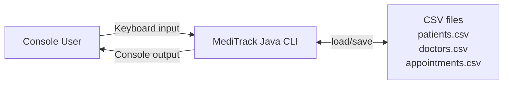
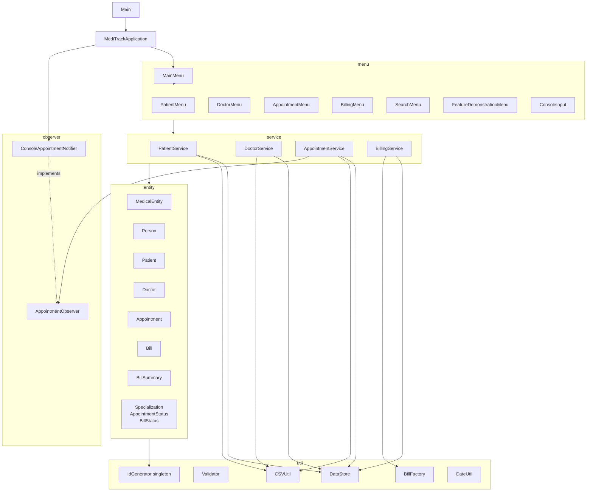
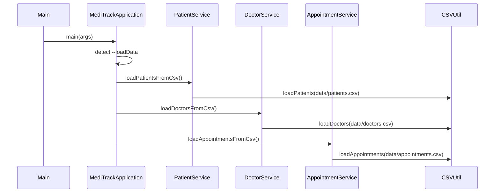
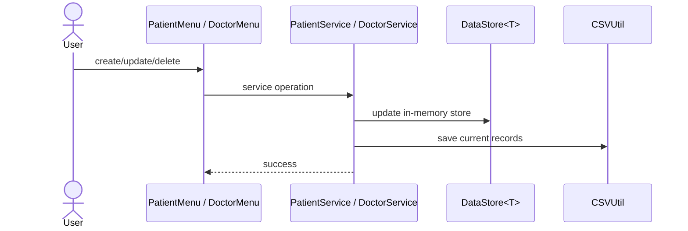
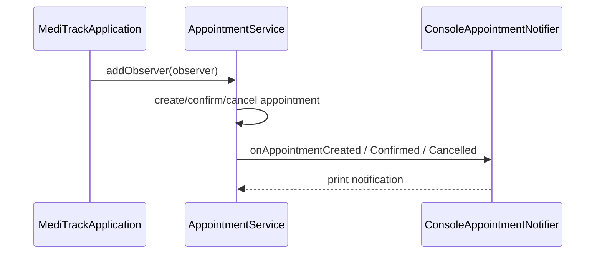
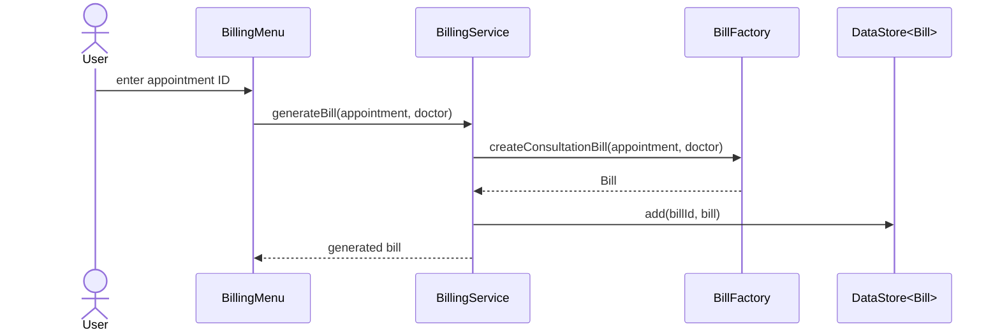

# MediTrack System Design

## Scope

MediTrack is a single-process Java console application. It uses in-memory stores while the app is running and CSV files for durable patient, doctor, and appointment persistence.

The app does not currently include a database, network API, authentication, or external integrations.

## System Context

## Component View

## Main Data Flows

### Startup With `--loadData`

Patients load before doctors and appointments. Appointments validate that referenced patient and doctor IDs exist.

### Patient / Doctor Save

### Appointment Observer Flow

### Billing

## Architectural Notes

- `MedicalEntity` owns shared entity identity; `Person` extends it, and `Patient` / `Doctor` extend `Person`.
- `IdGenerator` is an eager singleton. It owns counters and syncs counters after loading CSV IDs.
- `CSVUtil` uses try-with-resources and simple comma splitting per assignment requirements.
- `BillFactory` centralizes bill construction for `BillingService`.
- `AppointmentService` is the observer subject for appointment lifecycle events.
- `DataStore<T>` is still the runtime repository; CSV persistence is a simple file-backed durability layer.

## Current Limitations

- CSV parsing is simple and does not support commas inside user-entered fields.
- Billing records are not persisted to CSV.
- The app is single-user and single-process; `IdGenerator` methods are synchronized, but stores are not designed for concurrent writers.
