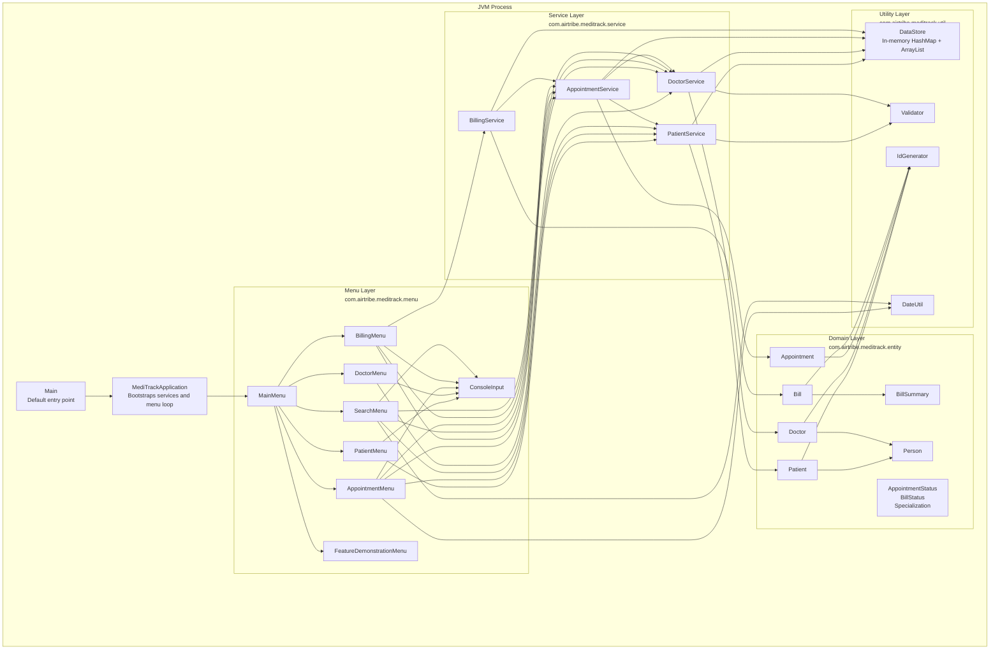
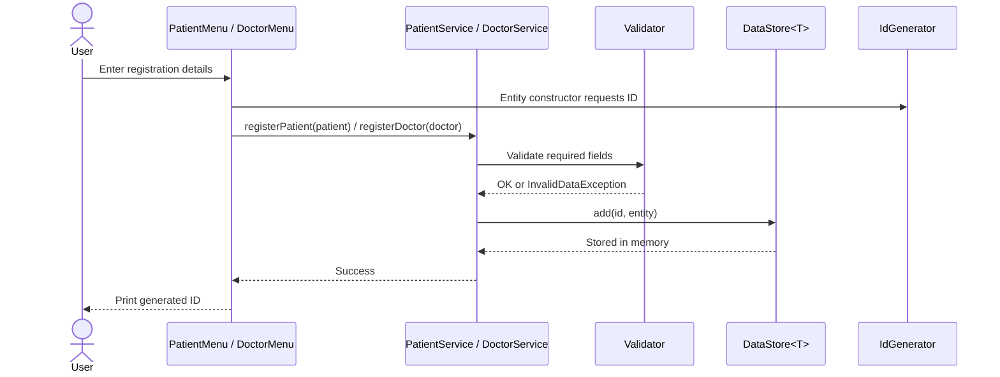
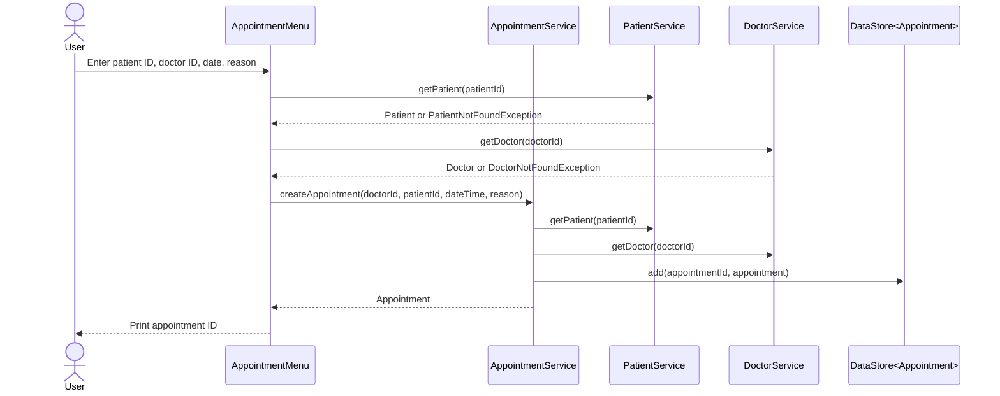
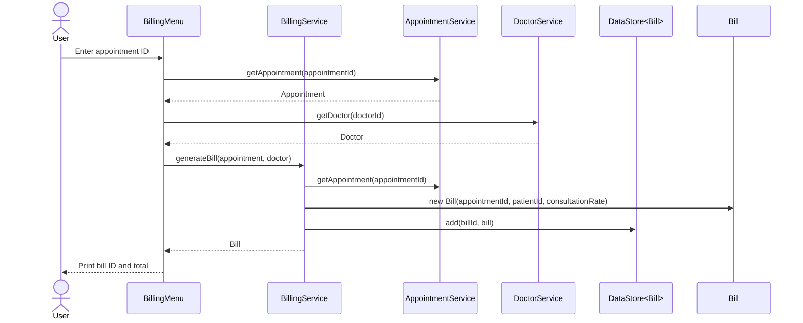

# MediTrack System Design Diagram

## Scope

MediTrack is currently a single-process console application. It has no database, network API, authentication layer, or external integrations. Data is stored in memory through `DataStore<T>`, so all records are lost when the JVM exits.

## System Context

## Container / Component View

## Main Data Flows

### Patient / Doctor Registration

### Appointment Booking

### Billing

## Architectural Notes

- The menu layer owns console input/output only. It should not own business rules.
- The service layer owns validation orchestration, lookup, status changes, and in-memory persistence access.
- The entity layer owns domain state and simple domain behavior such as appointment status transitions and bill total calculation.
- `DataStore<T>` is an in-memory repository substitute, not durable persistence.
- `Appointment` stores `patientId` and `doctorId` instead of object references. This keeps the entity simple but means services must enforce referential integrity.

## Current Risks / Limitations

- Data is not durable. Restarting the application clears all patients, doctors, appointments, and bills.
- `DataStore.add` can duplicate items in `dataList` when the same ID is added again.
- Delete operations do not protect referential integrity. A patient or doctor can be deleted while appointments still reference their IDs.
- Billing service silently ignores unknown bill IDs for charge/payment updates.
- There is no concurrency protection beyond synchronized ID generation. This is acceptable for the current single-user CLI but not for a multi-user application.
